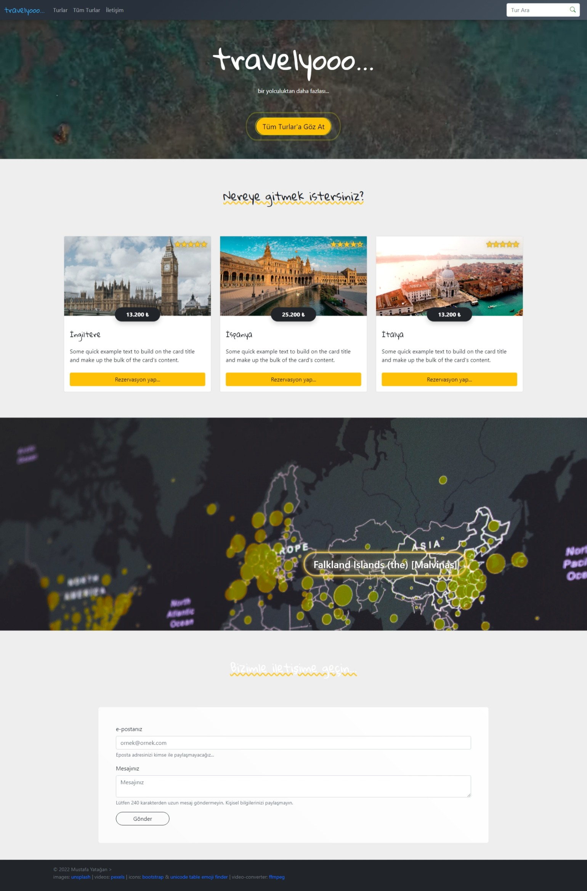

# İsmek Bootstrap Projesi: Travelyoo...

*ismek bootstrap project: travelyoo..*

Bir tatil rezervasyon sitesi tasarımı.

A vacation reservation website design.



## Filtreleme


```javascript
function turAra(query) {
  const qry = query.toLowerCase()
  return found = locations.filter(
    location => location.title.toLowerCase().includes(qry) || 
    location.content.toLowerCase().includes(qry) || 
    location.lists.some(
      list => list.toLowerCase().includes(qry)
      )
    );
}
```

## Harita


```javascript
  /**
   * internetten bulduğum bir ülke adları listesinden rastgele ülke adı çağırır
  */
  function getACountry() {
    return countryList[
      Math.round(Math.random() * countryList.length)
      ]
  }

  const transDur = 1500
  countryElem.innerText = getACountry()
  // 1,5 saniyede bir, ülke adı elementinin sol ve üst pozistyonunu, ülke adını değiştirir. Animasyon kısmı css'ten geliyor. "transition: all 1000ms ease;"
  const countInt = setInterval(() => {
    nereye.style = `left: ${Math.floor(Math.random() * 50)+20}%; top: ${Math.floor(Math.random() * 60)+20}%; font-size: ${((Math.random() * 3)+2).toFixed(2)}rem`;
    countryElem.innerText = getACountry();
  }, transDur);
```
